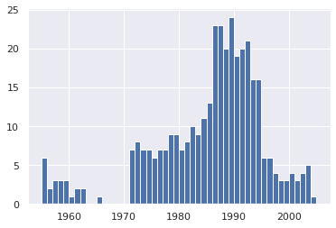
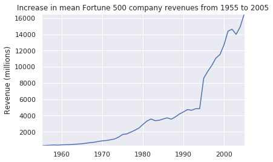
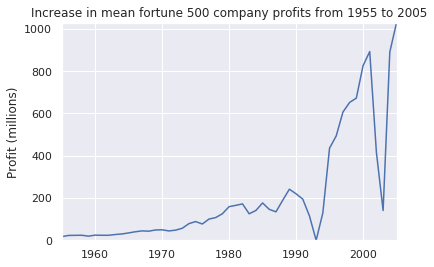

# Final Project for Computational Biology
Michael Foster
Spring 2023
Dr. Vandenbrink
Louisiana Tech University

## Sections Required

### Using Jupyter Notebooks (1,2) 
```python
#Michael Foster's Tutorial Notebook :)
```


```python
%matplotlib inline
import pandas as pd
import matplotlib.pyplot as plt
import seaborn as sns 
sns.set(style="darkgrid")
```


```python
df = pd.read_csv('fortune500.csv')
```


```python
df.head()
```


<div>
<style scoped>
    .dataframe tbody tr th:only-of-type {
        vertical-align: middle;
    }

    .dataframe tbody tr th {
        vertical-align: top;
    }

    .dataframe thead th {
        text-align: right;
    }
</style>
<table border="1" class="dataframe">
  <thead>
    <tr style="text-align: right;">
      <th></th>
      <th>Year</th>
      <th>Rank</th>
      <th>Company</th>
      <th>Revenue (in millions)</th>
      <th>Profit (in millions)</th>
    </tr>
  </thead>
  <tbody>
    <tr>
      <td>0</td>
      <td>1955</td>
      <td>1</td>
      <td>General Motors</td>
      <td>9823.5</td>
      <td>806</td>
    </tr>
    <tr>
      <td>1</td>
      <td>1955</td>
      <td>2</td>
      <td>Exxon Mobil</td>
      <td>5661.4</td>
      <td>584.8</td>
    </tr>
    <tr>
      <td>2</td>
      <td>1955</td>
      <td>3</td>
      <td>U.S. Steel</td>
      <td>3250.4</td>
      <td>195.4</td>
    </tr>
    <tr>
      <td>3</td>
      <td>1955</td>
      <td>4</td>
      <td>General Electric</td>
      <td>2959.1</td>
      <td>212.6</td>
    </tr>
    <tr>
      <td>4</td>
      <td>1955</td>
      <td>5</td>
      <td>Esmark</td>
      <td>2510.8</td>
      <td>19.1</td>
    </tr>
  </tbody>
</table>
</div>


```python
df.tail()
```


<div>
<style scoped>
    .dataframe tbody tr th:only-of-type {
        vertical-align: middle;
    }

    .dataframe tbody tr th {
        vertical-align: top;
    }

    .dataframe thead th {
        text-align: right;
    }
</style>
<table border="1" class="dataframe">
  <thead>
    <tr style="text-align: right;">
      <th></th>
      <th>Year</th>
      <th>Rank</th>
      <th>Company</th>
      <th>Revenue (in millions)</th>
      <th>Profit (in millions)</th>
    </tr>
  </thead>
  <tbody>
    <tr>
      <td>25495</td>
      <td>2005</td>
      <td>496</td>
      <td>Wm. Wrigley Jr.</td>
      <td>3648.6</td>
      <td>493</td>
    </tr>
    <tr>
      <td>25496</td>
      <td>2005</td>
      <td>497</td>
      <td>Peabody Energy</td>
      <td>3631.6</td>
      <td>175.4</td>
    </tr>
    <tr>
      <td>25497</td>
      <td>2005</td>
      <td>498</td>
      <td>Wendy's International</td>
      <td>3630.4</td>
      <td>57.8</td>
    </tr>
    <tr>
      <td>25498</td>
      <td>2005</td>
      <td>499</td>
      <td>Kindred Healthcare</td>
      <td>3616.6</td>
      <td>70.6</td>
    </tr>
    <tr>
      <td>25499</td>
      <td>2005</td>
      <td>500</td>
      <td>Cincinnati Financial</td>
      <td>3614.0</td>
      <td>584</td>
    </tr>
  </tbody>
</table>
</div>


```python
df.columns = ['year', 'rank', 'company', 'revenue', 'profit']
```


```python
len(df)
```


    25500


```python
df.dtypes
```


    year         int64
    rank         int64
    company     object
    revenue    float64
    profit      object
    dtype: object


```python
non_numberic_profits = df.profit.str.contains('[^0-9.-]')
df.loc[non_numberic_profits].head()

```


    14.409831723


```python
set(df.profit[non_numberic_profits])
```


    {'N.A.'}


```python
len(df.profit[non_numberic_profits])
```


    369


```python
bin_sizes, _, _ = plt.hist(df.year[non_numberic_profits], bins=range(1955, 2006))
```





```python
df = df.loc[~non_numberic_profits]
df.profit = df.profit.apply(pd.to_numeric)
```


```python
len(df)
```


    25131


```python
df.dtypes
```


    year         int64
    rank         int64
    company     object
    revenue    float64
    profit     float64
    dtype: object


```python
group_by_year = df.loc[:, ['year', 'revenue', 'profit']].groupby('year')
avgs = group_by_year.mean()
x = avgs.index
y1 = avgs.profit
def plot(x, y, ax, title, y_label):
    ax.set_title(title)
    ax.set_ylabel(y_label)
    ax.plot(x, y)
    ax.margins(x=0, y=0)
```


```python
fig, ax = plt.subplots()
plot(x, y1, ax, 'Increase in mean fortune 500 company profits from 1955 to 2005', 'Profit (millions)')
```


```python
y2 = avgs.revenue
fig, ax = plt.subplots()
plot(x, y2, ax, 'Increase in mean Fortune 500 company revenues from 1955 to 2005', 'Revenue (millions)')
```





```python
def plot_with_std(x, y, stds, ax, title, y_label):
    ax.fill_between(x, y - stds, y + stds, alpha=0.2)
    plot(x, y, ax, title, y_label)
fig, (ax1, ax2) = plt.subplots(ncols=2)
title = 'Increase in mean and std fortune 500 company %s from 1955 to 2005'
stds1 = group_by_year.std().profit.values
stds2 = group_by_year.std().revenue.values
plot_with_std(x, y1.values, stds1, ax1, title % 'profits', 'Profit (millions)')
plot_with_std(x, y2.values, stds2, ax2, title % 'revenues', 'Revenue (millions)')
fig.set_size_inches(14,4)
fig.tight_layout()
```





```python
#gonna use this a lot in my future analyses :)
```
***
### Python Fundamentals
# Python Fundamentals


```python
# Any python interpreter can be used as a calculator: 
3 + 5 * 4
```


    23


```python
# lets set a variable to a value
weight_kg = 60
```


```python
print(weight_kg)
```

    60


```python
# weight0 = valid
# 0weight = invalid
# weight and Weight are different
```


```python
# Types of data
# three common types of data
## Integers
## floating point numbers
## strings
```


```python
# floating point number
weight_kg = 60.3

# string of letters
patient_name = 'John Smith'

#String comprised of numbers
patient_id = '001'
```


```python
# use variables in python

# convert weight in kg to lbs
weight_lb = 2.2 * weight_kg

print(weight_lb)
```

    132.66


```python
# can add to strings
#lets add a prefix to patient ID
patient_id = 'inflam_' + patient_id
print(patient_id)
```

    inflam_001


```python
# lets combine print statements
print(patient_id, 'weight in kg:', weight_kg)
```

    inflam_001 weight in kg: 60.3


```python
# we can call a function inside another function
print(type(60.3))
print(type(patient_id))
```

    <class 'float'>
    <class 'str'>


```python
# we can also do calculations inside the print function
print('weight in lbs:', 2.2 * weight_kg)
```

    weight in lbs: 132.66


```python
print(weight_kg)
```

    60.3


```python
weight_kg = 65.0
print('weight in kilograms is now:', weight_kg)
```

    weight in kilograms is now: 65.0

***
### Analyzing Data (1,2,3)


***
### Storing Values in Lists


***
### Using Loops


***
### Using Multiple Files


***
### Making Choices


***
### Functions (1,2,3,4)


***
### Defensive Programming


***
### Transcribing DNA into RNA


***
### Translating RNA into Protein

