# Michael Foster's Final Project for BISC450C
## Python for Computational Biology - Spring 2023
#### https://github.com/mjfos2r/Python-BISC450C

<hr><font color="green"><h1>01.IntroToJupyterNotebook</h1></font>


```python
#########################################
# Michael Foster's Tutorial Notebook :) #
#########################################
```


```python
%matplotlib inline
import pandas as pd
import matplotlib.pyplot as plt
import seaborn as sns 
sns.set(style="darkgrid")
```


```python
df = pd.read_csv('fortune500.csv')
```


```python
df.head()
```


<div>
<style scoped>
    .dataframe tbody tr th:only-of-type {
        vertical-align: middle;
    }

    .dataframe tbody tr th {
        vertical-align: top;
    }

    .dataframe thead th {
        text-align: right;
    }
</style>
<table border="1" class="dataframe">
  <thead>
    <tr style="text-align: right;">
      <th></th>
      <th>Year</th>
      <th>Rank</th>
      <th>Company</th>
      <th>Revenue (in millions)</th>
      <th>Profit (in millions)</th>
    </tr>
  </thead>
  <tbody>
    <tr>
      <td>0</td>
      <td>1955</td>
      <td>1</td>
      <td>General Motors</td>
      <td>9823.5</td>
      <td>806</td>
    </tr>
    <tr>
      <td>1</td>
      <td>1955</td>
      <td>2</td>
      <td>Exxon Mobil</td>
      <td>5661.4</td>
      <td>584.8</td>
    </tr>
    <tr>
      <td>2</td>
      <td>1955</td>
      <td>3</td>
      <td>U.S. Steel</td>
      <td>3250.4</td>
      <td>195.4</td>
    </tr>
    <tr>
      <td>3</td>
      <td>1955</td>
      <td>4</td>
      <td>General Electric</td>
      <td>2959.1</td>
      <td>212.6</td>
    </tr>
    <tr>
      <td>4</td>
      <td>1955</td>
      <td>5</td>
      <td>Esmark</td>
      <td>2510.8</td>
      <td>19.1</td>
    </tr>
  </tbody>
</table>
</div>


```python
df.tail()
```


<div>
<style scoped>
    .dataframe tbody tr th:only-of-type {
        vertical-align: middle;
    }

    .dataframe tbody tr th {
        vertical-align: top;
    }

    .dataframe thead th {
        text-align: right;
    }
</style>
<table border="1" class="dataframe">
  <thead>
    <tr style="text-align: right;">
      <th></th>
      <th>Year</th>
      <th>Rank</th>
      <th>Company</th>
      <th>Revenue (in millions)</th>
      <th>Profit (in millions)</th>
    </tr>
  </thead>
  <tbody>
    <tr>
      <td>25495</td>
      <td>2005</td>
      <td>496</td>
      <td>Wm. Wrigley Jr.</td>
      <td>3648.6</td>
      <td>493</td>
    </tr>
    <tr>
      <td>25496</td>
      <td>2005</td>
      <td>497</td>
      <td>Peabody Energy</td>
      <td>3631.6</td>
      <td>175.4</td>
    </tr>
    <tr>
      <td>25497</td>
      <td>2005</td>
      <td>498</td>
      <td>Wendy's International</td>
      <td>3630.4</td>
      <td>57.8</td>
    </tr>
    <tr>
      <td>25498</td>
      <td>2005</td>
      <td>499</td>
      <td>Kindred Healthcare</td>
      <td>3616.6</td>
      <td>70.6</td>
    </tr>
    <tr>
      <td>25499</td>
      <td>2005</td>
      <td>500</td>
      <td>Cincinnati Financial</td>
      <td>3614.0</td>
      <td>584</td>
    </tr>
  </tbody>
</table>
</div>


```python
df.columns = ['year', 'rank', 'company', 'revenue', 'profit']
```


```python
len(df)
```


    25500


```python
df.dtypes
```


    year         int64
    rank         int64
    company     object
    revenue    float64
    profit      object
    dtype: object


```python
non_numberic_profits = df.profit.str.contains('[^0-9.-]')
df.loc[non_numberic_profits].head()

```


    14.409831723


```python
set(df.profit[non_numberic_profits])
```


    {'N.A.'}


```python
len(df.profit[non_numberic_profits])
```


    369


```python
bin_sizes, _, _ = plt.hist(df.year[non_numberic_profits], bins=range(1955, 2006))
```


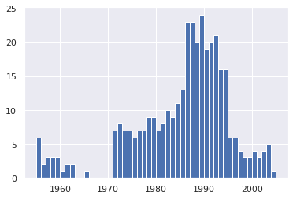


```python
df = df.loc[~non_numberic_profits]
df.profit = df.profit.apply(pd.to_numeric)
```


```python
len(df)
```


    25131


```python
df.dtypes
```


    year         int64
    rank         int64
    company     object
    revenue    float64
    profit     float64
    dtype: object


```python
group_by_year = df.loc[:, ['year', 'revenue', 'profit']].groupby('year')
avgs = group_by_year.mean()
x = avgs.index
y1 = avgs.profit
def plot(x, y, ax, title, y_label):
    ax.set_title(title)
    ax.set_ylabel(y_label)
    ax.plot(x, y)
    ax.margins(x=0, y=0)
```


```python
fig, ax = plt.subplots()
plot(x, y1, ax, 'Increase in mean fortune 500 company profits from 1955 to 2005', 'Profit (millions)')
```


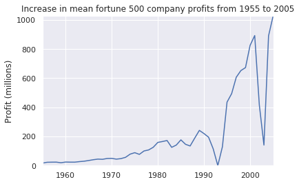


```python
y2 = avgs.revenue
fig, ax = plt.subplots()
plot(x, y2, ax, 'Increase in mean Fortune 500 company revenues from 1955 to 2005', 'Revenue (millions)')
```


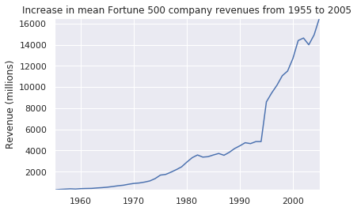


```python
def plot_with_std(x, y, stds, ax, title, y_label):
    ax.fill_between(x, y - stds, y + stds, alpha=0.2)
    plot(x, y, ax, title, y_label)
fig, (ax1, ax2) = plt.subplots(ncols=2)
title = 'Increase in mean and std fortune 500 company %s from 1955 to 2005'
stds1 = group_by_year.std().profit.values
stds2 = group_by_year.std().revenue.values
plot_with_std(x, y1.values, stds1, ax1, title % 'profits', 'Profit (millions)')
plot_with_std(x, y2.values, stds2, ax2, title % 'revenues', 'Revenue (millions)')
fig.set_size_inches(14,4)
fig.tight_layout()
```


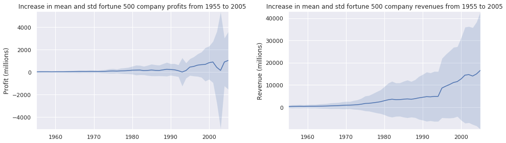


```python
#gonna use this a lot in my future analyses :)
```

<hr><font color="green"><h1>02.PythonFundamentals</h1></font>


```python
#######################
# Python Fundamentals #
#######################
```


```python
# Any python interpreter can be used as a calculator: 
3 + 5 * 4
```


    23


```python
# lets set a variable to a value
weight_kg = 60
```


```python
print(weight_kg)
```

    60


```python
# weight0 = valid
# 0weight = invalid
# weight and Weight are different
```


```python
# Types of data
# three common types of data
## Integers
## floating point numbers
## strings
```


```python
# floating point number
weight_kg = 60.3

# string of letters
patient_name = 'John Smith'

#String comprised of numbers
patient_id = '001'
```


```python
# use variables in python

# convert weight in kg to lbs
weight_lb = 2.2 * weight_kg

print(weight_lb)
```

    132.66


```python
# can add to strings
#lets add a prefix to patient ID
patient_id = 'inflam_' + patient_id
print(patient_id)
```

    inflam_001


```python
# lets combine print statements
print(patient_id, 'weight in kg:', weight_kg)
```

    inflam_001 weight in kg: 60.3


```python
# we can call a function inside another function
print(type(60.3))
print(type(patient_id))
```

    <class 'float'>
    <class 'str'>


```python
# we can also do calculations inside the print function
print('weight in lbs:', 2.2 * weight_kg)
```

    weight in lbs: 132.66


```python
print(weight_kg)
```

    60.3


```python
weight_kg = 65.0
print('weight in kilograms is now:', weight_kg)
```

    weight in kilograms is now: 65.0


<hr><font color="green"><h1>03.AnalyzingPtData</h1></font>


```python
##########################
# Analyzing Patient Data #
##########################
```


```python
###########
# Part 1. #
###########
```


```python
import numpy
```


```python
numpy.loadtxt(fname = 'data/inflammation-01.csv', delimiter = ',')
```


    array([[0., 0., 1., ..., 3., 0., 0.],
           [0., 1., 2., ..., 1., 0., 1.],
           [0., 1., 1., ..., 2., 1., 1.],
           ...,
           [0., 1., 1., ..., 1., 1., 1.],
           [0., 0., 0., ..., 0., 2., 0.],
           [0., 0., 1., ..., 1., 1., 0.]])


```python
data = numpy.loadtxt(fname = 'data/inflammation-01.csv', delimiter = ',')
```


```python
print(data)
```

    [[0. 0. 1. ... 3. 0. 0.]
     [0. 1. 2. ... 1. 0. 1.]
     [0. 1. 1. ... 2. 1. 1.]
     ...
     [0. 1. 1. ... 1. 1. 1.]
     [0. 0. 0. ... 0. 2. 0.]
     [0. 0. 1. ... 1. 1. 0.]]


```python
print(type(data))
```

    <class 'numpy.ndarray'>


```python
print(data.shape)
```

    (60, 40)


```python
# arrays start at 0
print('first value in data:', data[0,0])
```

    first value in data: 0.0


```python
print('middle value in data:', data[29,19])
```

    middle value in data: 16.0


```python
# lets get to slicing
#0:4 = 0,1,2,3 but not 4
#0:10 = 0,1,2,3,4,5,6,7,8,9 but not 10

print(data[0:4, 0:10])
```

    [[0. 0. 1. 3. 1. 2. 4. 7. 8. 3.]
     [0. 1. 2. 1. 2. 1. 3. 2. 2. 6.]
     [0. 1. 1. 3. 3. 2. 6. 2. 5. 9.]
     [0. 0. 2. 0. 4. 2. 2. 1. 6. 7.]]


```python
print(data[5:10, 0:10])
```

    [[0. 0. 1. 2. 2. 4. 2. 1. 6. 4.]
     [0. 0. 2. 2. 4. 2. 2. 5. 5. 8.]
     [0. 0. 1. 2. 3. 1. 2. 3. 5. 3.]
     [0. 0. 0. 3. 1. 5. 6. 5. 5. 8.]
     [0. 1. 1. 2. 1. 3. 5. 3. 5. 8.]]


```python
small = data[:3, 36:]
```


```python
print('small is:')
print(small)
```

    small is:
    [[2. 3. 0. 0.]
     [1. 1. 0. 1.]
     [2. 2. 1. 1.]]


```python
###########
# Part 2. #
###########
```


```python
# lets use a numpy function
print(numpy.mean(data))
```

    6.14875


```python
maxval, minval, stdval = numpy.amax(data), numpy.amin(data), numpy.std(data)
print('maximum inflammation:', maxval)
print('minimum inflammation:', minval)
print('standard deviation:', stdval)
```

    maximum inflammation: 20.0
    minimum inflammation: 0.0
    standard deviation: 4.613833197118566


```python
maxval = numpy.amax(data)
minval = numpy.amin(data)
stdval = numpy.std(data)
```


```python
print('maximum inflammation:', maxval)
print('minimum inflammation:', minval)
print('standard deviation:', stdval)
```

    maximum inflammation: 20.0
    minimum inflammation: 0.0
    standard deviation: 4.613833197118566


```python
# sometimes we want to look at variation in statistical values,
# such as maxmimum inflammation per patient or average from day 1

patient_0 = data[0, :] # 0 for first axis (rows), everything on the second (columns)
print('maximum inflammation for patient_0:', numpy.amax(patient_0))
```

    maximum inflammation for patient_0: 18.0


```python
# now lets look at patient 2
patient_2 = data[2, :]
print('maximum inflammation for patient_2:', numpy.amax(patient_2))
```

    maximum inflammation for patient_2: 19.0


```python
# ok lets get max inflammation for all patients
# axis = 0 gives column averages
# axis = 1 gives row averages

print(numpy.mean(data, axis = 0))
```

    [ 0.          0.45        1.11666667  1.75        2.43333333  3.15
      3.8         3.88333333  5.23333333  5.51666667  5.95        5.9
      8.35        7.73333333  8.36666667  9.5         9.58333333 10.63333333
     11.56666667 12.35       13.25       11.96666667 11.03333333 10.16666667
     10.          8.66666667  9.15        7.25        7.33333333  6.58333333
      6.06666667  5.95        5.11666667  3.6         3.3         3.56666667
      2.48333333  1.5         1.13333333  0.56666667]


```python
print(numpy.mean(data, axis = 0).shape)
```

    (40,)


```python
print(numpy.mean(data, axis = 1))
```

    [5.45  5.425 6.1   5.9   5.55  6.225 5.975 6.65  6.625 6.525 6.775 5.8
     6.225 5.75  5.225 6.3   6.55  5.7   5.85  6.55  5.775 5.825 6.175 6.1
     5.8   6.425 6.05  6.025 6.175 6.55  6.175 6.35  6.725 6.125 7.075 5.725
     5.925 6.15  6.075 5.75  5.975 5.725 6.3   5.9   6.75  5.925 7.225 6.15
     5.95  6.275 5.7   6.1   6.825 5.975 6.725 5.7   6.25  6.4   7.05  5.9  ]


```python
###########
# Part 3. #
###########
```


```python
import matplotlib.pyplot

#heatmap of patient inflammation over time
image = matplotlib.pyplot.imshow(data)
matplotlib.pyplot.show()
```


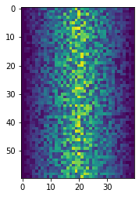


```python
# average inflammation over time
# axis = 0 <- average across columns
ave_inflammation = numpy.mean(data, axis = 0)
ave_plot = matplotlib.pyplot.plot(ave_inflammation)
matplotlib.pyplot.show()
```


```python
max_plot = matplotlib.pyplot.plot(numpy.amax(data, axis = 0))
matplotlib.pyplot.show()
```


```python
min_plot = matplotlib.pyplot.plot(numpy.amin(data, axis = 0))
matplotlib.pyplot.show()
```


```python
fig = matplotlib.pyplot.figure(figsize =(10.0, 3.0))

axes1 = fig.add_subplot(1, 3, 1)
axes2 = fig.add_subplot(1, 3, 2)
axes3 = fig.add_subplot(1, 3, 3)

axes1.set_ylabel('average')
axes1.plot(numpy.mean(data, axis = 0))

axes2.set_ylabel('max')
axes2.plot(numpy.amax(data, axis = 0))

axes3.set_ylabel('min')
axes3.plot(numpy.amin(data, axis = 0))

fig.tight_layout()

matplotlib.pyplot.savefig('inflammation.png')
matplotlib.pyplot.show()
```


```python

```

<hr><font color="green"><h1>04.Lists</h1></font>


```python
###########################
# Storing Values in Lists #
###########################
```


```python
odds = [1,3,5,7]
print("odds are:", odds)
```

    odds are: [1, 3, 5, 7]


```python
print('first element:', odds[0])
print('last element:', odds[3])
# Can count backwards in lists! 
print('"-1" element:', odds [-1])
print('"-2" element:', odds [-2])
print('"-3" element:', odds [-3])
```

    first element: 1
    last element: 7
    "-1" element: 7
    "-2" element: 5
    "-3" element: 3


```python
# we can change lists, we can't change strings
names = ['Curie', 'Darwing', 'Turing'] # Typo in Darwin's name
print('names is originally:', names)
names[1] = 'Darwin' # correct the name
print('Final value of names:', names)
```

    names is originally: ['Curie', 'Darwing', 'Turing']
    Final value of names: ['Curie', 'Darwin', 'Turing']


```python
#name = 'Darwin'
#name[0] = 'd'
#gives the following:
#TypeError: 'str' object does not support item assignment
```


```python
odds.append(11)
print('odds after adding a value:', odds)
```

    odds after adding a value: [1, 3, 5, 7, 11]


```python
# Push = add to list
# pop = remove from list
# origin is from the early early days of computing
removed_element = odds.pop(0)
print('odds after removing the first element:', odds)
print('removed element:', removed_element)
```

    odds after removing the first element: [3, 5, 7, 11]
    removed element: 1


```python
odds.reverse()
print('odds after reversing:', odds)
```

    odds after reversing: [11, 7, 5, 3]


```python
odds = [3,5,7]
#primes and odds are the same
primes = odds
primes.append(2)
#output shows that they are treated the same
print('primes:', primes)
print('odds:', odds)
```

    primes: [3, 5, 7, 2]
    odds: [3, 5, 7, 2]


```python
odds = [3,5,7]
#primes is a copy of odds
primes = list(odds)
primes.append(2)
#output shows that they are not treated as the same object
print('primes:', primes)
print('odds:', odds)
```

    primes: [3, 5, 7, 2]
    odds: [3, 5, 7]


```python
binomial_name = "Drosophila melanogaster"
group = binomial_name[0:10]
print('group:', group)

species = binomial_name[11:23]
print('species:', species)

chromosomes = ['X', 'Y', '2', '3', '4']
autosomes = chromosomes[2:5]
print('autosomes:', autosomes)

last = chromosomes[-1]
print('last:', last)
```

    group: Drosophila
    species: melanogaster
    autosomes: ['2', '3', '4']
    last: 4


```python
date = 'Sunday 14 May 2023'
day = date[0:6]
print('using 0 to begin range:', day)
day = date[:6]
print('omitting beginning index:', day)
```

    using 0 to begin range: Sunday
    omitting beginning index: Sunday


```python
months = ['Jan', 'Feb', 'Mar', 'Apr', 'May', 'Jun', 'Jul', 'Aug', 'Sep', 'Oct', 'Nov', 'Dec']
sond = months[8:12]
print('with known last positions:', sond)

sond = months[8:len(months)]
print('using len() to get last entry:', sond)

sond = months[8:]
print('omitting ending index:', sond)
```

    with known last positions: ['Sep', 'Oct', 'Nov', 'Dec']
    using len() to get last entry: ['Sep', 'Oct', 'Nov', 'Dec']
    omitting ending index: ['Sep', 'Oct', 'Nov', 'Dec']


```python

```

<hr><font color="green"><h1>05.Loops</h1></font>


```python
##########
# Loops! #
##########
```


```python
odds = [1,3,5,7]
```


```python
print(odds[0])
print(odds[1])
print(odds[2])
print(odds[3])
```

    1
    3
    5
    7


```python
#example of why the above is not optimal
odds = [1,3,5]
print(odds[0])
print(odds[1])
print(odds[2])
#print(odds[3])
#gives: IndexError: list index out of range

```

    1
    3
    5


```python
# ok so lets make a loop now

odds = [1,3,5,7,9,11,13,15,17,19]
for num in odds:
    print(num)
# refer to loop cycle diagram
```

    1
    3
    5
    7
    9
    11
    13
    15
    17
    19


```python
length = 0
names = ['Curie', 'Darwin', 'Turing']
for value in names:
    length = length + 1
    print('I have counted', length, 'names')
print('There are', length, 'names in the list.')
```

    I have counted 1 names
    I have counted 2 names
    I have counted 3 names
    There are 3 names in the list.


```python
name = 'Rosalind'
# Don't reuse variable names for loops, it will overwrite your variable for the loop
for name in ['Curie', 'Darwin', 'Turing']:
    print(name)
print('after the loop, name is:', name)
```

    Curie
    Darwin
    Turing
    after the loop, name is: Turing


```python
print(len([0,1,2,3]))
```

    4


```python
name = ['Curie', 'Darwin', 'Turing']
print(len(name))
```

    3


```python
# Loops are nicer in python than in R.
# R makes nicer plots though.
```

<hr><font color="green"><h1>06.UsingMultipleFiles</h1></font>


```python
########################
# Using Multiple Files #
########################
```


```python
# Back to Software Carpentry folder 
# (I refuse, I will path to the files as needed)
```


```python
# imports library with fxn named 'glob' that can be used for 
# working with files and wildcards and regex and etc
import glob
print(glob.glob('../swc-python/data/inflammation*.csv'))
```

    ['../swc-python/data/inflammation-05.csv', '../swc-python/data/inflammation-12.csv', '../swc-python/data/inflammation-04.csv', '../swc-python/data/inflammation-08.csv', '../swc-python/data/inflammation-10.csv', '../swc-python/data/inflammation-06.csv', '../swc-python/data/inflammation-09.csv', '../swc-python/data/inflammation-01.csv', '../swc-python/data/inflammation-07.csv', '../swc-python/data/inflammation-11.csv', '../swc-python/data/inflammation-03.csv', '../swc-python/data/inflammation-02.csv']


```python
import numpy
import matplotlib.pyplot

#import all inflammation .csv files
filenames = sorted(glob.glob('../swc-python/data/inflammation*.csv'))
#overwrite list to only work on 3 patients rn
filenames = filenames[0:3]

for filename in filenames:
    print(filename)
    
    data = numpy.loadtxt(fname = filename, delimiter = ',')
    fig = matplotlib.pyplot.figure(figsize = (10.0, 3.0))
    
    axes1 = fig.add_subplot(1,3,1)
    axes2 = fig.add_subplot(1,3,2)
    axes3 = fig.add_subplot(1,3,3)
    
    axes1.set_ylabel('average')
    axes1.plot(numpy.mean(data, axis = 0))
    
    axes2.set_ylabel('max')
    axes2.plot(numpy.amax(data, axis = 0))
    
    axes3.set_ylabel('min')
    axes3.plot(numpy.amin(data, axis = 0))
    
    fig.tight_layout()
    matplotlib.pyplot.show()
    
```

    ../swc-python/data/inflammation-01.csv


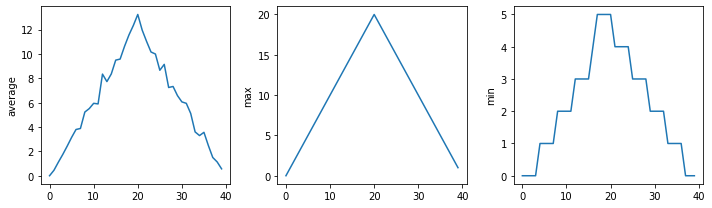


    ../swc-python/data/inflammation-02.csv


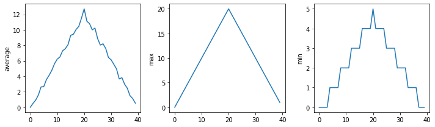


    ../swc-python/data/inflammation-03.csv


```python
# data is sus
# always important to check for sus data
# may not be malicious but human error
```


```python

```

<hr><font color="green"><h1>07.MakingChoices</h1></font>


```python
##################
# Making Choices #
##################
```


```python
# if, then, else
```


```python
num = 37
if num > 100:
    print('greater')
else:
    print('not greater')
print('done')
```

    not greater
    done


```python
# refer to t/f flowchart
```


```python
num = 53
print('before conditional.....')
if num > 100:
    print(num, 'is greater than 100')
print('..... after conditional')
```

    before conditional.....
    ..... after conditional


```python
# no print since num !> 100
# else not required
```


```python
#now lets do elseif
num = 14
if num > 0:
    print(num, 'is positive')
elif num == 0:
    print(num, 'is zero')
else:
    print(num, 'is negative')
```

    14 is positive


```python
if (1 > 0) and (-1 >= 0):
    print('both parts are true')
else: 
    print('at least one part is false')
```

    at least one part is false


```python
# 1 > 0 but -1 !>= 0
```


```python
if (1 > 0) or (-1 >= 0):
    print('at least one part is true')
else:
    print('both of these are false')
```

    at least one part is true


```python
# Moving into data folder in swc-python, I refuse, I am just going to path into it.
```


```python
# Assuming inside swc-python/data
# just gonna set a variable to the correct path and add it to whatever is importing stuff in there
path2data= '../swc-python/data/'

import numpy
```


```python
data = numpy.loadtxt(fname=path2data+'inflammation-01.csv', delimiter=',')
```


```python
max_inflammation_0 = numpy.amax(data,axis = 0)[0]
```


```python
max_inflammation_20 = numpy.amax(data, axis = 0)[20]
if max_inflammation_0 == 0 and max_inflammation_20 == 20:
    print('Suspicious looking maxima!!')
```

    Suspicious looking maxima!!


```python
if max_inflammation_0 == 0 and max_inflammation_20 == 20:
    print('Suspicious looking maxima!!')
elif numpy.sum(numpy.amin(data, axis = 0)) == 0:
    print('minima add up to zero')
else:
    print('seems OK')
```

    Suspicious looking maxima!!


```python
data = numpy.loadtxt(fname = path2data+'inflammation-03.csv', delimiter=',')

max_inflammation_0 = numpy.amax(data, axis = 0)[0]
max_inflammation_20 = numpy.amax(data, axis = 0)[20]
```


```python
if max_inflammation_0 == 0 and max_inflammation_20 == 20:
    print('suspicious looking maxima!')
elif numpy.sum(numpy.amin(data, axis = 0)) == 0:
    print('minima add up to zero! -> HEALTHY PARTICIPANT ALERT')
else:
    print('Seems OK!')
```

    minima add up to zero! -> HEALTHY PARTICIPANT ALERT


```python

```

<hr><font color="green"><h1>08.Functions</h1></font>


```python
#############
# Functions #
#############
```


```python
###########
# Part 1. #
###########
```


```python
# Function to convert fahrenheit into celsius
fahrenheit_val = 99
celsius_val = ((fahrenheit_val - 32) * (5/9))
print(celsius_val)
```

    37.22222222222222


```python
fahrenheit_val2 = 43
celsius_val2 = ((fahrenheit_val2 - 32) * (5/9))
print(celsius_val2)
```

    6.111111111111112


```python
def explicit_fahr_to_celsius(temp):
    # assign the converted value to a variable
    converted = ((temp - 32) * (5/9))
    return converted
```


```python
def fahr_to_celsius(temp):
    # return converted values more efficiently using the return function without creating
    # a new variable. this code does the same thing as the previous function but it is more
    # explicit in explaining how the return command works.
    return ((temp - 32) * (5/9))
```


```python
# ok lets try em out
fahr_to_celsius(32)
```


    0.0


```python
explicit_fahr_to_celsius(32)
```


    0.0


```python
# same results. neat
```


```python
# can nest functions.
print('freezing point of water:', fahr_to_celsius(32), 'C')
print('Boiling point of water:', fahr_to_celsius(212), 'C')
```

    freezing point of water: 0.0 C
    Boiling point of water: 100.0 C


```python
#ok now celsius to kelvin
def celsius_to_kelvin(temp_c):
    return temp_c + 273.15

print('freezing point of water in kelvin:', celsius_to_kelvin(0))
```

    freezing point of water in kelvin: 273.15


```python
# now fahrenheit to kelvin
def fahr_to_kelvin(temp_f):
    temp_c = fahr_to_celsius(temp_f)
    temp_k = celsius_to_kelvin(temp_c)
    return temp_k
print('boiling point of water in kelvin:', fahr_to_kelvin(212.0))
```

    boiling point of water in kelvin: 373.15


```python
# print('Again, temperature in kelvin was:', temp_k)
# gives this error: NameError: name 'temp_k' is not defined
# variables in functions are LOCAL VARIABLES and are not permanent
# to use outside of function, must be defined outside of function

temp_kelvin = fahr_to_kelvin(212.0)
print('Temperature in kelvin was:', temp_kelvin)
```

    Temperature in kelvin was: 373.15


```python
temp_kelvin
```


    373.15


```python
# Variables in function = LOCAL
# Variables outside function = GLOBAL
# functions can read GLOBAL but only the function can read its own LOCAL variables
```


```python
def print_temperature():
    print('Temperature in Fahrenheit was:', temp_fahr)
    print('Temperature in Kelvin was:', temp_kelvin)

temp_fahr = 212.0
temp_kelvin = fahr_to_kelvin(temp_fahr)

print_temperature()
```

    Temperature in Fahrenheit was: 212.0
    Temperature in Kelvin was: 373.15


```python
###########
# Part 2. #
###########
```


```python
import numpy
import glob
import matplotlib
import matplotlib.pyplot
```


```python
def visualize(filename):
    data = numpy.loadtxt(fname = filename, delimiter = ',')
    
    fig = matplotlib.pyplot.figure(figsize=(10.0, 3.0))
    
    axes1 = fig.add_subplot(1,3,1)
    axes2 = fig.add_subplot(1,3,2)
    axes3 = fig.add_subplot(1,3,3)
    
    axes1.set_ylabel('average')
    axes1.plot(numpy.mean(data, axis=0))
    
    axes2.set_ylabel('max')
    axes2.plot(numpy.amax(data, axis=0))
    
    axes3.set_ylabel('min')
    axes3.plot(numpy.amin(data, axis=0))
    
    fig.tight_layout()
    matplotlib.pyplot.show()
```


```python
def detect_problems(filename):
    data = numpy.loadtxt(fname = filename, delimiter = ',')
    
    if numpy.amax(data, axis = 0)[0] == 0 and numpy.amax(data, axis = 0)[20] == 20:
        print('suspicious looking maxima \n')
    elif numpy.sum(numpy.amin(data, axis = 0)) == 0:
        print('minima add up to zero! \n')
    else:
        print('Seems OK. \n')
```


```python
path2files = '../swc-python/data/'
filenames = sorted(glob.glob(path2files+'inflammation*.csv'))

for filename in filenames:
    print(filename)
    visualize(filename)
    detect_problems(filename)
```

    ../swc-python/data/inflammation-01.csv


    suspicious looking maxima 
    
    ../swc-python/data/inflammation-02.csv


    suspicious looking maxima 
    
    ../swc-python/data/inflammation-03.csv


    minima add up to zero! 
    
    ../swc-python/data/inflammation-04.csv


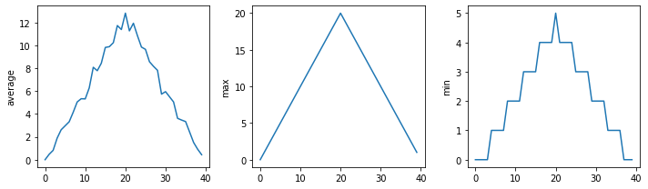


    suspicious looking maxima 
    
    ../swc-python/data/inflammation-05.csv


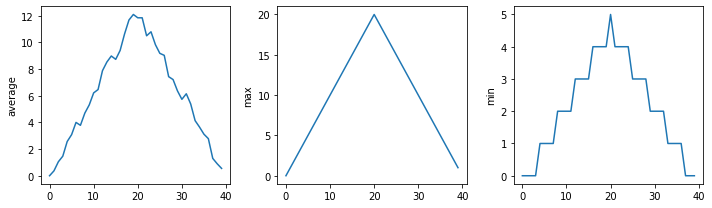


    suspicious looking maxima 
    
    ../swc-python/data/inflammation-06.csv


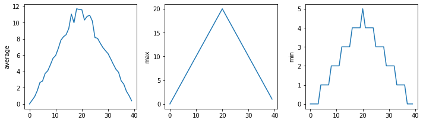


    suspicious looking maxima 
    
    ../swc-python/data/inflammation-07.csv


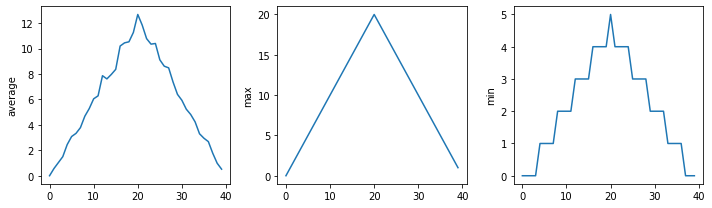


    suspicious looking maxima 
    
    ../swc-python/data/inflammation-08.csv


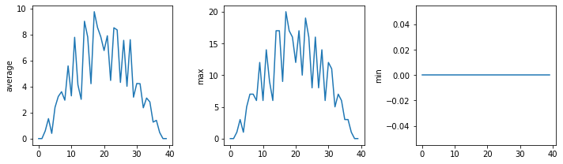


    minima add up to zero! 
    
    ../swc-python/data/inflammation-09.csv


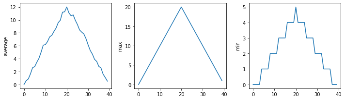


    suspicious looking maxima 
    
    ../swc-python/data/inflammation-10.csv


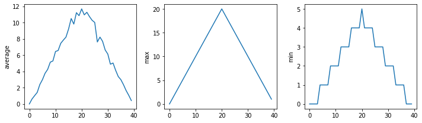


    suspicious looking maxima 
    
    ../swc-python/data/inflammation-11.csv


    minima add up to zero! 
    
    ../swc-python/data/inflammation-12.csv


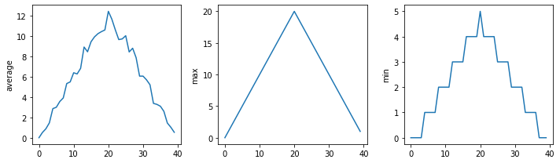


    suspicious looking maxima 
    


```python
###########
# Part 3. #
###########
```


```python
def offset_mean(data, target_mean_value):
    return (data - numpy.mean(data)) + target_mean_value
```


```python
z = numpy.zeros((2,2))
print(offset_mean(z, 3))
```

    [[3. 3.]
     [3. 3.]]


```python
data = numpy.loadtxt(fname = path2files+'inflammation-01.csv', delimiter = ',')
print(offset_mean(data, 0))
```

    [[-6.14875 -6.14875 -5.14875 ... -3.14875 -6.14875 -6.14875]
     [-6.14875 -5.14875 -4.14875 ... -5.14875 -6.14875 -5.14875]
     [-6.14875 -5.14875 -5.14875 ... -4.14875 -5.14875 -5.14875]
     ...
     [-6.14875 -5.14875 -5.14875 ... -5.14875 -5.14875 -5.14875]
     [-6.14875 -6.14875 -6.14875 ... -6.14875 -4.14875 -6.14875]
     [-6.14875 -6.14875 -5.14875 ... -5.14875 -5.14875 -6.14875]]


```python
print('original min, mean, and max are:', numpy.amin(data), numpy.mean(data), numpy.amax(data))
offset_data = offset_mean(data, 0)
print('min, mean, and max of offset data are:', numpy.amin(offset_data), numpy.mean(offset_data), numpy.amax(offset_data))
```

    original min, mean, and max are: 0.0 6.14875 20.0
    min, mean, and max of offset data are: -6.14875 2.842170943040401e-16 13.85125


```python
# shifts towards zero
```


```python
print('stddev before:', numpy.std(data), 'and after:', numpy.std(offset_data))
```

    stddev before: 4.613833197118566 and after: 4.613833197118566


```python
print('difference in stddev before and after:', numpy.std(data) - numpy.std(offset_data))
```

    difference in stddev before and after: 0.0


```python
# offset_mean(data, target_mean_value):
# return a new array containing the original data with its mean offset to match the desired value.
# this data should be input as measurements in columns and samples as rows, etc.
def offset_mean(data, target_mean_value):
    return (data -numpy.mean(data)) + target_mean_value
```


```python
# docstring example
def offset_mean(data, target_mean_value):
    """return a new array containing the original data with its mean offset to match the odesired value"""
    return(data - numpy.mean(data)) + target_mean_value
```


```python
help(offset_mean)
```

    Help on function offset_mean in module __main__:
    
    offset_mean(data, target_mean_value)
        return a new array containing the original data with its mean offset to match the odesired value
    


```python
def offset_mean(data, target_mean_value):
    """
    Return a new array containing the original data
    with its mean offset to match the desired value.
    
    examples:
    ---------
    >>>>offset_mean([1,2,3], 0)
    array([-1., 0., 1.])
    """
    return (data - numpy.mean(data)) + target_mean_value
```


```python
help(offset_mean)
```

    Help on function offset_mean in module __main__:
    
    offset_mean(data, target_mean_value)
        Return a new array containing the original data
        with its mean offset to match the desired value.
        
        examples:
        ---------
        >>>>offset_mean([1,2,3], 0)
        array([-1., 0., 1.])
    


```python
###########
# Part 4. #
###########
```


```python
numpy.loadtxt(path2files+'inflammation-01.csv', delimiter = ',')
```


    array([[0., 0., 1., ..., 3., 0., 0.],
           [0., 1., 2., ..., 1., 0., 1.],
           [0., 1., 1., ..., 2., 1., 1.],
           ...,
           [0., 1., 1., ..., 1., 1., 1.],
           [0., 0., 0., ..., 0., 2., 0.],
           [0., 0., 1., ..., 1., 1., 0.]])


```python
# numpy.loadtxt(path2files+'inflammation-01.csv', ',')
# gives error : SyntaxError: unexpected EOF while parsing
def offset_mean(data, target_mean_value = 0.0):
    """
    Return a new array containing the original data
    with its mean offset to match the desired value.
    
    examples:
    ---------
    >>>>offset_mean([1,2,3], 0)
    array([-1., 0., 1.])
    """
    return (data - numpy.mean(data)) + target_mean_value
```


```python
test_data = numpy.zeros((2,2))
print(offset_mean(test_data, 3))
```

    [[3. 3.]
     [3. 3.]]


```python
print(offset_mean(test_data))
```

    [[0. 0.]
     [0. 0.]]


```python
def display(a=1, b=2, c=3):
    print('a', a)
    print('b', b)
    print('c', c)
    
print('no parameters:')
display()
print('one parameters:')
display(55)
print('two parameters:')
display(55,66)
```

    no parameters:
    a 1
    b 2
    c 3
    one parameters:
    a 55
    b 2
    c 3
    two parameters:
    a 55
    b 66
    c 3


```python
print('only setting the value of c')
display(c = 77)
```

    only setting the value of c
    a 1
    b 2
    c 77


```python
# Okay, this represents the whole journey of learning about default arguments
# numpy.loadtxt(path2files+'inflammation-01.csv', ',')
# help(numpy.loadtxt)
```


```python
# and to demonstrate the correct functioning of np.loadtxt:
numpy.loadtxt(path2files+'inflammation-01.csv', delimiter = ',')
```


    array([[0., 0., 1., ..., 3., 0., 0.],
           [0., 1., 2., ..., 1., 0., 1.],
           [0., 1., 1., ..., 2., 1., 1.],
           ...,
           [0., 1., 1., ..., 1., 1., 1.],
           [0., 0., 0., ..., 0., 2., 0.],
           [0., 0., 1., ..., 1., 1., 0.]])


```python
# poorly written 
def s(p):
    a = 0
    for v in p:
        a += v
    m = a / len(p)
    d = 0
    for v in p:
        d += (v - m) * (v - m)
    return numpy.sqrt(d / (len(p) - 1))

# Same as above but better written for human comprehension
def std_dev(sample):
    sample_sum = 0
    for value in sample:
        sample_sum += value
    
    sample_mean = sample_sum / len(sample)
    
    sum_squared_devs = 0
    for value in sample:
        sum_squared_devs += (value - sample_mean) * (value - sample_mean)
        
    return numpy.sqrt(sum_squared_devs / (len(sample) -1 ))
```


```python

```

<hr><font color="green"><h1>09.DefensiveProgramming</h1></font>


```python
#########################
# Defensive Programming #
#########################
```


```python
numbers = [1.5, 2.3, 0.7, -0.001, 4.4]
total = 0.0
for num in numbers:
    assert num > 0.0, 'data should only contain positive values'
    total += num
print('total is:', total)
# gives this error:
# AssertionError: data should only contain positive values
```


    ---------------------------------------------------------------------------

    AssertionError                            Traceback (most recent call last)

    <ipython-input-1-e68c698c8fb4> in <module>
          2 total = 0.0
          3 for num in numbers:
    ----> 4     assert num > 0.0, 'data should only contain positive values'
          5     total += num
          6 print('total is:', total)


    AssertionError: data should only contain positive values


```python
def normalize_rectangle(rect):
    """ Normalizes a rectangle so that it is at the origin and 1.0 units long on its longest axis.
    input should be of the format (x0, y0, x1, y1)
    (x0, y0) and (x1, y1) define the lower left and upper right corners of the rectangle respectively"""
    assert len(rect) == 4, 'rectangles must contain 4 coordinates'
    x0, y0, x1, y1 = rect
    assert x0 < x1, 'invalid X coordinates'
    assert y0 < y1, 'invalid Y coordinates'
    
    dx = x1 - x0
    dy = y1 - y0
    if dx > dy:
        scaled = dy / dx
        upper_x, upper_y = 1.0, scaled
    else:
        scaled = dx / dy
        upper_x, upper_y = scaled, 1.0
        
    assert 0 < upper_x <= 1.0, 'calculated upper x coordinate invalid'
    assert 0 < upper_y <= 1.0, 'calculated upper y coordinate invalid'
    
    return (0, 0, upper_x, upper_y)
```


```python
print(normalize_rectangle( (0.0, 1.0, 2.0) ))
# gives error:
# AssertionError: rectangles must contain 4 coordinates
```


    ---------------------------------------------------------------------------

    AssertionError                            Traceback (most recent call last)

    <ipython-input-3-53e8ad19cbf2> in <module>
    ----> 1 print(normalize_rectangle( (0.0, 1.0, 2.0) ))
          2 # gives error:
          3 # AssertionError: rectangles must contain 4 coordinates


    <ipython-input-2-3c4574c2dae9> in normalize_rectangle(rect)
          3     input should be of the format (x0, y0, x1, y1)
          4     (x0, y0) and (x1, y1) define the lower left and upper right corners of the rectangle respectively"""
    ----> 5     assert len(rect) == 4, 'rectangles must contain 4 coordinates'
          6     x0, y0, x1, y1 = rect
          7     assert x0 < x1, 'invalid X coordinates'


    AssertionError: rectangles must contain 4 coordinates


```python
print(normalize_rectangle( (4.0, 2.0, 1.0, 5.0) ))
# gives error:
# AssertionError: invalid X coordinates
```


    ---------------------------------------------------------------------------

    AssertionError                            Traceback (most recent call last)

    <ipython-input-4-5d475aa44f84> in <module>
    ----> 1 print(normalize_rectangle( (4.0, 2.0, 1.0, 5.0) ))
          2 # gives error:
          3 # AssertionError: invalid X coordinates


    <ipython-input-2-3c4574c2dae9> in normalize_rectangle(rect)
          5     assert len(rect) == 4, 'rectangles must contain 4 coordinates'
          6     x0, y0, x1, y1 = rect
    ----> 7     assert x0 < x1, 'invalid X coordinates'
          8     assert y0 < y1, 'invalid Y coordinates'
          9 


    AssertionError: invalid X coordinates


```python
# rearranging the previous coordinates to work
print(normalize_rectangle( (1.0, 2.0, 4.0, 5.0) ))
# changing the coordinates to be different, but work
print(normalize_rectangle( (0.0, 0.0, 1.0, 5.0) ))
```

    (0, 0, 1.0, 1.0)
    (0, 0, 0.2, 1.0)


```python
print(normalize_rectangle( (0.0, 0.0, 5.0, 1.0)))
# gives error:
# AssertionError: calculated upper y coordinate invalid.
# rectangle is wider than tall.
# changed ln14 to dy/dx from dx/dy

# try again
print(normalize_rectangle( (0.0, 0.0, 5.0, 1.0)))
#works now.
```

    (0, 0, 1.0, 0.2)
    (0, 0, 1.0, 0.2)


```python
# Assertions are very very very useful. 
# I could have used this in so many things I've done.
# will be using it from now on.
```

<hr><font color="green"><h1>10.Transcription</h1></font>


```python
#################
# Transcription #
#################
```

Goal: write program to take DNA fasta and convert into RNA sequence.

Transcription = DNA -> RNA 

1. prompt user to enter the name of a DNA fasta that will be transcribed into an RNA fasta

2. read in the file

3. translate DNA into RNA
    a. T -> U
    
4. prompt user to save the new file (RNA Output)
    a. So that we can use this file for the translation step.

5. Print RNA sequence.

***

ok lets get a fasta file now.
- got NOTCH3 (NC_000019.10)
saved as sequence.fasta, used the main CDS, not the isoform.


```python
# Prompt user to enter the fasta file name
input_file_name = input("Enter the name of the input fasta file")
```

    Enter the name of the input fasta file sequence.fasta


```python
# open the input fasta file and read the DNA sequence

with open(input_file_name, "r") as input_file:
    dna_sequence = ""
    for line in input_file:
        if line.startswith(">"):
            continue
        dna_sequence += line.strip()
```


```python
# transcribe the DNA to RNA
rna_sequence = ""
for nucleotide in dna_sequence:
    if nucleotide == "T":
        rna_sequence += "U"
    else:
        rna_sequence += nucleotide
```


```python
# prompt user to enter the output file name
output_file_name = input("Enter the name of the output file:")
```

    Enter the name of the output file: notch3_rna.fasta


```python
# save the RNA sequence to a .fasta file
with open(output_file_name, "w") as output_file:
    output_file.write(rna_sequence)
    print(f"The RNA sequence has been saved to {output_file_name}")
```

    The RNA sequence has been saved to notch3_rna.fasta


```python
print(rna_sequence)
```

    AUGGGGCCGGGGGCCCGUGGCCGCCGCCGCCGCCGUCGCCCGAUGUCGCCGCCACCGCCACCGCCACCCGUGCGGGCGCUGCCCCUGCUGCUGCUGCUAGCGGGGCCGGGGGCUGCAGCCCCCCCUUGCCUGGACGGAAGCCCGUGUGCAAAUGGAGGUCGUUGCACCCAGCUGCCCUCCCGGGAGGCUGCCUGCCUGUGCCCGCCUGGCUGGGUGGGUGAGCGGUGUCAGCUGGAGGACCCCUGUCACUCAGGCCCCUGUGCUGGCCGUGGUGUCUGCCAGAGUUCAGUGGUGGCUGGCACCGCCCGAUUCUCAUGCCGGUGCCCCCGUGGCUUCCGAGGCCCUGACUGCUCCCUGCCAGAUCCCUGCCUCAGCAGCCCUUGUGCCCACGGUGCCCGCUGCUCAGUGGGGCCCGAUGGACGCUUCCUCUGCUCCUGCCCACCUGGCUACCAGGGCCGCAGCUGCCGAAGCGACGUGGAUGAGUGCCGGGUGGGUGAGCCCUGCCGCCAUGGUGGCACCUGCCUCAACACACCUGGCUCCUUCCGCUGCCAGUGUCCAGCUGGCUACACAGGGCCACUAUGUGAGAACCCCGCGGUGCCCUGUGCACCCUCACCAUGCCGUAACGGGGGCACCUGCAGGCAGAGUGGCGACCUCACUUACGACUGUGCCUGUCUUCCUGGGUUUGAGGGUCAGAAUUGUGAAGUGAACGUGGACGACUGUCCAGGACACCGAUGUCUCAAUGGGGGGACAUGCGUGGAUGGCGUCAACACCUAUAACUGCCAGUGCCCUCCUGAGUGGACAGGCCAGUUCUGCACGGAGGACGUGGAUGAGUGUCAGCUGCAGCCCAACGCCUGCCACAAUGGGGGUACCUGCUUCAACACGCUGGGUGGCCACAGCUGCGUGUGUGUCAAUGGCUGGACAGGCGAGAGCUGCAGUCAGAAUAUCGAUGACUGUGCCACAGCCGUGUGCUUCCAUGGGGCCACCUGCCAUGACCGCGUGGCUUCUUUCUACUGUGCCUGCCCCAUGGGCAAGACUGGCCUCCUGUGUCACCUGGAUGACGCCUGUGUCAGCAACCCCUGCCACGAGGAUGCUAUCUGUGACACAAAUCCGGUGAACGGCCGGGCCAUUUGCACCUGUCCUCCCGGCUUCACGGGUGGGGCAUGUGACCAGGAUGUGGACGAGUGCUCUAUCGGCGCCAACCCCUGCGAGCACUUGGGCAGGUGCGUGAACACGCAGGGCUCCUUCCUGUGCCAGUGCGGUCGUGGCUACACUGGACCUCGCUGUGAGACCGAUGUCAACGAGUGUCUGUCGGGGCCCUGCCGAAACCAGGCCACGUGCCUCGACCGCAUAGGCCAGUUCACCUGUAUCUGUAUGGCAGGCUUCACAGGAACCUAUUGCGAGGUGGACAUUGACGAGUGUCAGAGUAGCCCCUGUGUCAACGGUGGGGUCUGCAAGGACCGAGUCAAUGGCUUCAGCUGCACCUGCCCCUCGGGCUUCAGCGGCUCCACGUGUCAGCUGGACGUGGACGAAUGCGCCAGCACGCCCUGCAGGAAUGGCGCCAAAUGCGUGGACCAGCCCGAUGGCUACGAGUGCCGCUGUGCCGAGGGCUUUGAGGGCACGCUGUGUGAUCGCAACGUGGACGACUGCUCCCCUGACCCAUGCCACCAUGGUCGCUGCGUGGAUGGCAUCGCCAGCUUCUCAUGUGCCUGUGCUCCUGGCUACACGGGCACACGCUGCGAGAGCCAGGUGGACGAAUGCCGCAGCCAGCCCUGCCGCCAUGGCGGCAAAUGCCUAGACCUGGUGGACAAGUACCUCUGCCGCUGCCCUUCUGGGACCACAGGUGUGAACUGCGAAGUGAACAUUGACGACUGUGCCAGCAACCCCUGCACCUUUGGAGUCUGCCGUGAUGGCAUCAACCGCUACGACUGUGUCUGCCAACCUGGCUUCACAGGGCCCCUUUGUAACGUGGAGAUCAAUGAGUGUGCUUCCAGCCCAUGCGGCGAGGGAGGUUCCUGUGUGGAUGGGGAAAAUGGCUUCCGCUGCCUCUGCCCGCCUGGCUCCUUGCCCCCACUCUGCCUCCCCCCGAGCCAUCCCUGUGCCCAUGAGCCCUGCAGUCACGGCAUCUGCUAUGAUGCACCUGGCGGGUUCCGCUGUGUGUGUGAGCCUGGCUGGAGUGGCCCCCGCUGCAGCCAGAGCCUGGCCCGAGACGCCUGUGAGUCCCAGCCGUGCAGGGCCGGUGGGACAUGCAGCAGCGAUGGAAUGGGUUUCCACUGCACCUGCCCGCCUGGUGUCCAGGGACGUCAGUGUGAACUCCUCUCCCCCUGCACCCCGAACCCCUGUGAGCAUGGGGGCCGCUGCGAGUCUGCCCCUGGCCAGCUGCCUGUCUGCUCCUGCCCCCAGGGCUGGCAAGGCCCACGAUGCCAGCAGGAUGUGGACGAGUGUGCUGGCCCCGCACCCUGUGGCCCUCAUGGUAUCUGCACCAACCUGGCAGGGAGUUUCAGCUGCACCUGCCAUGGAGGGUACACUGGCCCUUCCUGCGAUCAGGACAUCAAUGACUGUGACCCCAACCCAUGCCUGAACGGUGGCUCGUGCCAAGACGGCGUGGGCUCCUUUUCCUGCUCCUGCCUCCCUGGUUUCGCCGGCCCACGAUGCGCCCGCGAUGUGGAUGAGUGCCUGAGCAACCCCUGCGGCCCGGGCACCUGUACCGACCACGUGGCCUCCUUCACCUGCACCUGCCCGCCAGGCUACGGAGGCUUCCACUGCGAACAGGACCUGCCCGACUGCAGCCCCAGCUCCUGCUUCAAUGGCGGGACCUGUGUGGACGGCGUGAACUCGUUCAGCUGCCUGUGCCGUCCCGGCUACACAGGAGCCCACUGCCAACAUGAGGCAGACCCCUGCCUCUCGCGGCCCUGCCUACACGGGGGCGUCUGCAGCGCCGCCCACCCUGGCUUCCGCUGCACCUGCCUCGAGAGCUUCACGGGCCCGCAGUGCCAGACGCUGGUGGAUUGGUGCAGCCGCCAGCCUUGUCAAAACGGGGGUCGCUGCGUCCAGACUGGGGCCUAUUGCCUUUGUCCCCCUGGAUGGAGCGGACGCCUCUGUGACAUCCGAAGCUUGCCCUGCAGGGAGGCCGCAGCCCAGAUCGGGGUGCGGCUGGAGCAGCUGUGUCAGGCGGGUGGGCAGUGUGUGGAUGAAGACAGCUCCCACUACUGCGUGUGCCCAGAGGGCCGUACUGGUAGCCACUGUGAGCAGGAGGUGGACCCCUGCUUGGCCCAGCCCUGCCAGCAUGGGGGGACCUGCCGUGGCUAUAUGGGGGGCUACAUGUGUGAGUGUCUUCCUGGCUACAAUGGUGAUAACUGUGAGGACGACGUGGACGAGUGUGCCUCCCAGCCCUGCCAGCACGGGGGUUCAUGCAUUGACCUCGUGGCCCGCUAUCUCUGCUCCUGUCCCCCAGGAACGCUGGGGGUGCUCUGCGAGAUUAAUGAGGAUGACUGCGGCCCAGGCCCACCGCUGGACUCAGGGCCCCGGUGCCUACACAAUGGCACCUGCGUGGACCUGGUGGGUGGUUUCCGCUGCACCUGUCCCCCAGGAUACACUGGUUUGCGCUGCGAGGCAGACAUCAAUGAGUGUCGCUCAGGUGCCUGCCACGCGGCACACACCCGGGACUGCCUGCAGGACCCAGGCGGAGGUUUCCGUUGCCUUUGUCAUGCUGGCUUCUCAGGUCCUCGCUGUCAGACUGUCCUGUCUCCCUGCGAGUCCCAGCCAUGCCAGCAUGGAGGCCAGUGCCGUCCUAGCCCGGGUCCUGGGGGUGGGCUGACCUUCACCUGUCACUGUGCCCAGCCGUUCUGGGGUCCGCGUUGCGAGCGGGUGGCGCGCUCCUGCCGGGAGCUGCAGUGCCCGGUGGGCGUCCCAUGCCAGCAGACGCCCCGCGGGCCGCGCUGCGCCUGCCCCCCAGGGUUGUCGGGACCCUCCUGCCGCAGCUUCCCGGGGUCGCCGCCGGGGGCCAGCAACGCCAGCUGCGCGGCCGCCCCCUGUCUCCACGGGGGCUCCUGCCGCCCCGCGCCGCUCGCGCCCUUCUUCCGCUGCGCUUGCGCGCAGGGCUGGACCGGGCCGCGCUGCGAGGCGCCCGCCGCGGCACCCGAGGUCUCGGAGGAGCCGCGGUGCCCGCGCGCCGCCUGCCAGGCCAAGCGCGGGGACCAGCGCUGCGACCGCGAGUGCAACAGCCCAGGCUGCGGCUGGGACGGCGGCGACUGCUCGCUGAGCGUGGGCGACCCCUGGCGGCAAUGCGAGGCGCUGCAGUGCUGGCGCCUCUUCAACAACAGCCGCUGCGACCCCGCCUGCAGCUCGCCCGCCUGCCUCUACGACAACUUCGACUGCCACGCCGGUGGCCGCGAGCGCACUUGCAACCCGGUGUACGAGAAGUACUGCGCCGACCACUUUGCCGACGGCCGCUGCGACCAGGGCUGCAACACGGAGGAGUGCGGCUGGGAUGGGCUGGAUUGUGCCAGCGAGGUGCCGGCCCUGCUGGCCCGCGGCGUGCUGGUGCUCACAGUGCUGCUGCCGCCAGAGGAGCUACUGCGUUCCAGCGCCGACUUUCUGCAGCGGCUCAGCGCCAUCCUGCGCACCUCGCUGCGCUUCCGCCUGGACGCGCACGGCCAGGCCAUGGUCUUCCCUUACCACCGGCCUAGUCCUGGCUCCGAACCCCGGGCCCGUCGGGAGCUGGCCCCCGAGGUGAUCGGCUCGGUAGUAAUGCUGGAGAUUGACAACCGGCUCUGCCUGCAGUCGCCUGAGAAUGAUCACUGCUUCCCCGAUGCCCAGAGCGCCGCUGACUACCUGGGAGCGUUGUCAGCGGUGGAGCGCCUGGACUUCCCGUACCCACUGCGGGACGUGCGGGGGGAGCCGCUGGAGCCUCCAGAACCCAGCGUCCCGCUGCUGCCACUGCUAGUGGCGGGCGCUGUCUUGCUGCUGGUCAUUCUCGUCCUGGGUGUCAUGGUGGCCCGGCGCAAGCGCGAGCACAGCACCCUCUGGUUCCCUGAGGGCUUCUCACUGCACAAGGACGUGGCCUCUGGUCACAAGGGCCGGCGGGAACCCGUGGGCCAGGACGCGCUGGGCAUGAAGAACAUGGCCAAGGGUGAGAGCCUGAUGGGGGAGGUGGCCACAGACUGGAUGGACACAGAGUGCCCAGAGGCCAAGCGGCUAAAGGUAGAGGAGCCAGGCAUGGGGGCUGAGGAGGCUGUGGAUUGCCGUCAGUGGACUCAACACCAUCUGGUUGCUGCUGACAUCCGCGUGGCACCAGCCAUGGCACUGACACCACCACAGGGCGACGCAGAUGCUGAUGGCAUGGAUGUCAAUGUGCGUGGCCCAGAUGGCUUCACCCCGCUAAUGCUGGCUUCCUUCUGUGGGGGGGCUCUGGAGCCAAUGCCAACUGAAGAGGAUGAGGCAGAUGACACAUCAGCUAGCAUCAUCUCCGACCUGAUCUGCCAGGGGGCUCAGCUUGGGGCACGGACUGACCGUACUGGCGAGACUGCUUUGCACCUGGCUGCCCGUUAUGCCCGUGCUGAUGCAGCCAAGCGGCUGCUGGAUGCUGGGGCAGACACCAAUGCCCAGGACCACUCAGGCCGCACUCCCCUGCACACAGCUGUCACAGCCGAUGCCCAGGGUGUCUUCCAGAUUCUCAUCCGAAACCGCUCUACAGACUUGGAUGCCCGCAUGGCAGAUGGCUCAACGGCACUGAUCCUGGCGGCCCGCCUGGCAGUAGAGGGCAUGGUGGAAGAGCUCAUCGCCAGCCAUGCUGAUGUCAAUGCUGUGGAUGAGCUUGGGAAAUCAGCCUUACACUGGGCUGCGGCUGUGAACAACGUGGAAGCCACUUUGGCCCUGCUCAAAAAUGGAGCCAAUAAGGACAUGCAGGAUAGCAAGGAGGAGACCCCCCUAUUCCUGGCCGCCCGCGAGGGCAGCUAUGAGGCUGCCAAGCUGCUGUUGGACCACUUUGCCAACCGUGAGAUCACCGACCACCUGGACAGGCUGCCGCGGGACGUAGCCCAGGAGAGACUGCACCAGGACAUCGUGCGCUUGCUGGAUCAACCCAGUGGGCCCCGCAGCCCCCCCGGUCCCCACGGCCUGGGGCCUCUGCUCUGUCCUCCAGGGGCCUUCCUCCCUGGCCUCAAAGCGGCACAGUCGGGGUCCAAGAAGAGCAGGAGGCCCCCCGGGAAGGCGGGGCUGGGGCCGCAGGGGCCCCGGGGGCGGGGCAAGAAGCUGACGCUGGCCUGCCCGGGCCCCCUGGCUGACAGCUCGGUCACGCUGUCGCCCGUGGACUCGCUGGACUCCCCGCGGCCUUUCGGUGGGCCCCCUGCUUCCCCUGGUGGCUUCCCCCUUGAGGGGCCCUAUGCAGCUGCCACUGCCACUGCAGUGUCUCUGGCACAGCUUGGUGGCCCAGGCCGGGCGGGUCUAGGGCGCCAGCCCCCUGGAGGAUGUGUACUCAGCCUGGGCCUGCUGAACCCUGUGGCUGUGCCCCUCGAUUGGGCCCGGCUGCCCCCACCUGCCCCUCCAGGCCCCUCGUUCCUGCUGCCACUGGCGCCGGGACCCCAGCUGCUCAACCCAGGGACCCCCGUCUCCCCGCAGGAGCGGCCCCCGCCUUACCUGGCAGUCCCAGGACAUGGCGAGGAGUACCCGGCGGCUGGGGCACACAGCAGCCCCCCAAAGGCCCGCUUCCUGCGGGUUCCCAGUGAGCACCCUUACCUGACCCCAUCCCCCGAAUCCCCUGAGCACUGGGCCAGCCCCUCACCUCCCUCCCUCUCAGACUGGUCCGAAUCCACGCCUAGCCCAGCCACUGCCACUGGGGCCAUGGCCACCACCACUGGGGCACUGCCUGCCCAGCCACUUCCCUUGUCUGUUCCCAGCUCCCUUGCUCAGGCCCAGACCCAGCUGGGGCCCCAGCCGGAAGUUACCCCCAAGAGGCAAGUGUUGGCCUGA


<hr><font color="green"><h1>11.Translation</h1></font>


```python
###############
# Translation #
###############
```

Strategy for program that will take RNA sequence in a fasta file and translate it into a protein AA sequence.

1. prompt the user to enter the name of a file that has an RNA sequence.

2. open the file the user indicated.

3. translate the RNA codons into amino acid.

4. prompt the user to enter the name for the output file.

5. print the AA sequence to console.


```python
# Starting Program
```


```python
# Prompt the user to enter the RNA.fasta filename
input_file_name = input('Enter the name of the input RNA fasta file')
```

    Enter the name of the input RNA fasta file notch3_rna.fasta


```python
# Open the input RNA file and read the RNA sequence
with open(input_file_name, "r") as input_file:
    rna_sequence = input_file.read().strip()
```


```python
codon_table = {"UUU":"F", "UUC":"F", "UUA":"L", "UUG":"L",
       "UCU":"S", "UCC":"S", "UCA":"S", "UCG":"S",
       "UAU":"Y", "UAC":"Y", "UAA":"*", "UAG":"*",
       "UGU":"C", "UGC":"C", "UGA":"*", "UGG":"W",
       "CUU":"L", "CUC":"L", "CUA":"L", "CUG":"L",
       "CCU":"P", "CCC":"P", "CCA":"P", "CCG":"P",
       "CAU":"H", "CAC":"H", "CAA":"Q", "CAG":"Q",
       "CGU":"R", "CGC":"R", "CGA":"R", "CGG":"R",
       "AUU":"I", "AUC":"I", "AUA":"I", "AUG":"M",
       "ACU":"T", "ACC":"T", "ACA":"T", "ACG":"T",
       "AAU":"N", "AAC":"N", "AAA":"K", "AAG":"K",
       "AGU":"S", "AGC":"S", "AGA":"R", "AGG":"R",
       "GUU":"V", "GUC":"V", "GUA":"V", "GUG":"V",
       "GCU":"A", "GCC":"A", "GCA":"A", "GCG":"A",
       "GAU":"D", "GAC":"D", "GAA":"E", "GAG":"E",
       "GGU":"G", "GGC":"G", "GGA":"G", "GGG":"G",}
```


```python
# translate RNA to protein

protein_sequence = " "

for i in range(0, len(rna_sequence), 3):
    codon = rna_sequence[i:i+3]
    if len(codon) == 3:
        amino_acid = codon_table[codon]
        if amino_acid == "*":
            break
        protein_sequence += amino_acid
```


```python
# prompt the user to enter the output file name
output_file_name = input('Enter the name of the output file:')
```

    Enter the name of the output file: Notch3_protein.txt


```python
# save the protein sequence to a text file

with open(output_file_name, "w") as output_file:
    output_file.write(protein_sequence)
    print(f"the protein sequence has been saved to {output_file_name}")
```

    the protein sequence has been saved to Notch3_protein.txt


```python
print(protein_sequence)
```

     MGPGARGRRRRRRPMSPPPPPPPVRALPLLLLLAGPGAAAPPCLDGSPCANGGRCTQLPSREAACLCPPGWVGERCQLEDPCHSGPCAGRGVCQSSVVAGTARFSCRCPRGFRGPDCSLPDPCLSSPCAHGARCSVGPDGRFLCSCPPGYQGRSCRSDVDECRVGEPCRHGGTCLNTPGSFRCQCPAGYTGPLCENPAVPCAPSPCRNGGTCRQSGDLTYDCACLPGFEGQNCEVNVDDCPGHRCLNGGTCVDGVNTYNCQCPPEWTGQFCTEDVDECQLQPNACHNGGTCFNTLGGHSCVCVNGWTGESCSQNIDDCATAVCFHGATCHDRVASFYCACPMGKTGLLCHLDDACVSNPCHEDAICDTNPVNGRAICTCPPGFTGGACDQDVDECSIGANPCEHLGRCVNTQGSFLCQCGRGYTGPRCETDVNECLSGPCRNQATCLDRIGQFTCICMAGFTGTYCEVDIDECQSSPCVNGGVCKDRVNGFSCTCPSGFSGSTCQLDVDECASTPCRNGAKCVDQPDGYECRCAEGFEGTLCDRNVDDCSPDPCHHGRCVDGIASFSCACAPGYTGTRCESQVDECRSQPCRHGGKCLDLVDKYLCRCPSGTTGVNCEVNIDDCASNPCTFGVCRDGINRYDCVCQPGFTGPLCNVEINECASSPCGEGGSCVDGENGFRCLCPPGSLPPLCLPPSHPCAHEPCSHGICYDAPGGFRCVCEPGWSGPRCSQSLARDACESQPCRAGGTCSSDGMGFHCTCPPGVQGRQCELLSPCTPNPCEHGGRCESAPGQLPVCSCPQGWQGPRCQQDVDECAGPAPCGPHGICTNLAGSFSCTCHGGYTGPSCDQDINDCDPNPCLNGGSCQDGVGSFSCSCLPGFAGPRCARDVDECLSNPCGPGTCTDHVASFTCTCPPGYGGFHCEQDLPDCSPSSCFNGGTCVDGVNSFSCLCRPGYTGAHCQHEADPCLSRPCLHGGVCSAAHPGFRCTCLESFTGPQCQTLVDWCSRQPCQNGGRCVQTGAYCLCPPGWSGRLCDIRSLPCREAAAQIGVRLEQLCQAGGQCVDEDSSHYCVCPEGRTGSHCEQEVDPCLAQPCQHGGTCRGYMGGYMCECLPGYNGDNCEDDVDECASQPCQHGGSCIDLVARYLCSCPPGTLGVLCEINEDDCGPGPPLDSGPRCLHNGTCVDLVGGFRCTCPPGYTGLRCEADINECRSGACHAAHTRDCLQDPGGGFRCLCHAGFSGPRCQTVLSPCESQPCQHGGQCRPSPGPGGGLTFTCHCAQPFWGPRCERVARSCRELQCPVGVPCQQTPRGPRCACPPGLSGPSCRSFPGSPPGASNASCAAAPCLHGGSCRPAPLAPFFRCACAQGWTGPRCEAPAAAPEVSEEPRCPRAACQAKRGDQRCDRECNSPGCGWDGGDCSLSVGDPWRQCEALQCWRLFNNSRCDPACSSPACLYDNFDCHAGGRERTCNPVYEKYCADHFADGRCDQGCNTEECGWDGLDCASEVPALLARGVLVLTVLLPPEELLRSSADFLQRLSAILRTSLRFRLDAHGQAMVFPYHRPSPGSEPRARRELAPEVIGSVVMLEIDNRLCLQSPENDHCFPDAQSAADYLGALSAVERLDFPYPLRDVRGEPLEPPEPSVPLLPLLVAGAVLLLVILVLGVMVARRKREHSTLWFPEGFSLHKDVASGHKGRREPVGQDALGMKNMAKGESLMGEVATDWMDTECPEAKRLKVEEPGMGAEEAVDCRQWTQHHLVAADIRVAPAMALTPPQGDADADGMDVNVRGPDGFTPLMLASFCGGALEPMPTEEDEADDTSASIISDLICQGAQLGARTDRTGETALHLAARYARADAAKRLLDAGADTNAQDHSGRTPLHTAVTADAQGVFQILIRNRSTDLDARMADGSTALILAARLAVEGMVEELIASHADVNAVDELGKSALHWAAAVNNVEATLALLKNGANKDMQDSKEETPLFLAAREGSYEAAKLLLDHFANREITDHLDRLPRDVAQERLHQDIVRLLDQPSGPRSPPGPHGLGPLLCPPGAFLPGLKAAQSGSKKSRRPPGKAGLGPQGPRGRGKKLTLACPGPLADSSVTLSPVDSLDSPRPFGGPPASPGGFPLEGPYAAATATAVSLAQLGGPGRAGLGRQPPGGCVLSLGLLNPVAVPLDWARLPPPAPPGPSFLLPLAPGPQLLNPGTPVSPQERPPPYLAVPGHGEEYPAAGAHSSPPKARFLRVPSEHPYLTPSPESPEHWASPSPPSLSDWSESTPSPATATGAMATTTGALPAQPLPLSVPSSLAQAQTQLGPQPEVTPKRQVLA

