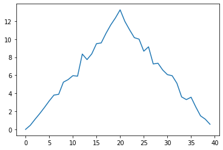
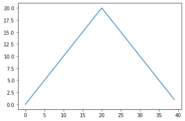
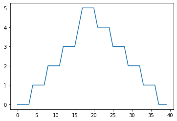

# Analyzing Patient Data


```python
# Part 1
```


```python
import numpy
```


```python
numpy.loadtxt(fname = 'data/inflammation-01.csv', delimiter = ',')
```


    array([[0., 0., 1., ..., 3., 0., 0.],
           [0., 1., 2., ..., 1., 0., 1.],
           [0., 1., 1., ..., 2., 1., 1.],
           ...,
           [0., 1., 1., ..., 1., 1., 1.],
           [0., 0., 0., ..., 0., 2., 0.],
           [0., 0., 1., ..., 1., 1., 0.]])


```python
data = numpy.loadtxt(fname = 'data/inflammation-01.csv', delimiter = ',')
```


```python
print(data)
```

    [[0. 0. 1. ... 3. 0. 0.]
     [0. 1. 2. ... 1. 0. 1.]
     [0. 1. 1. ... 2. 1. 1.]
     ...
     [0. 1. 1. ... 1. 1. 1.]
     [0. 0. 0. ... 0. 2. 0.]
     [0. 0. 1. ... 1. 1. 0.]]


```python
print(type(data))
```

    <class 'numpy.ndarray'>


```python
print(data.shape)
```

    (60, 40)


```python
# arrays start at 0
print('first value in data:', data[0,0])
```

    first value in data: 0.0


```python
print('middle value in data:', data[29,19])
```

    middle value in data: 16.0


```python
# lets get to slicing
#0:4 = 0,1,2,3 but not 4
#0:10 = 0,1,2,3,4,5,6,7,8,9 but not 10

print(data[0:4, 0:10])
```

    [[0. 0. 1. 3. 1. 2. 4. 7. 8. 3.]
     [0. 1. 2. 1. 2. 1. 3. 2. 2. 6.]
     [0. 1. 1. 3. 3. 2. 6. 2. 5. 9.]
     [0. 0. 2. 0. 4. 2. 2. 1. 6. 7.]]


```python
print(data[5:10, 0:10])
```

    [[0. 0. 1. 2. 2. 4. 2. 1. 6. 4.]
     [0. 0. 2. 2. 4. 2. 2. 5. 5. 8.]
     [0. 0. 1. 2. 3. 1. 2. 3. 5. 3.]
     [0. 0. 0. 3. 1. 5. 6. 5. 5. 8.]
     [0. 1. 1. 2. 1. 3. 5. 3. 5. 8.]]


```python
small = data[:3, 36:]
```


```python
print('small is:')
print(small)
```

    small is:
    [[2. 3. 0. 0.]
     [1. 1. 0. 1.]
     [2. 2. 1. 1.]]


```python
# Part 2
```


```python
# lets use a numpy function
print(numpy.mean(data))
```

    6.14875


```python
maxval, minval, stdval = numpy.amax(data), numpy.amin(data), numpy.std(data)
print('maximum inflammation:', maxval)
print('minimum inflammation:', minval)
print('standard deviation:', stdval)
```

    maximum inflammation: 20.0
    minimum inflammation: 0.0
    standard deviation: 4.613833197118566


```python
maxval = numpy.amax(data)
minval = numpy.amin(data)
stdval = numpy.std(data)
```


```python
print('maximum inflammation:', maxval)
print('minimum inflammation:', minval)
print('standard deviation:', stdval)
```

    maximum inflammation: 20.0
    minimum inflammation: 0.0
    standard deviation: 4.613833197118566


```python
# sometimes we want to look at variation in statistical values,
# such as maxmimum inflammation per patient or average from day 1

patient_0 = data[0, :] # 0 for first axis (rows), everything on the second (columns)
print('maximum inflammation for patient_0:', numpy.amax(patient_0))
```

    maximum inflammation for patient_0: 18.0


```python
# now lets look at patient 2
patient_2 = data[2, :]
print('maximum inflammation for patient_2:', numpy.amax(patient_2))
```

    maximum inflammation for patient_2: 19.0


```python
# ok lets get max inflammation for all patients
# axis = 0 gives column averages
# axis = 1 gives row averages

print(numpy.mean(data, axis = 0))
```

    [ 0.          0.45        1.11666667  1.75        2.43333333  3.15
      3.8         3.88333333  5.23333333  5.51666667  5.95        5.9
      8.35        7.73333333  8.36666667  9.5         9.58333333 10.63333333
     11.56666667 12.35       13.25       11.96666667 11.03333333 10.16666667
     10.          8.66666667  9.15        7.25        7.33333333  6.58333333
      6.06666667  5.95        5.11666667  3.6         3.3         3.56666667
      2.48333333  1.5         1.13333333  0.56666667]


```python
print(numpy.mean(data, axis = 0).shape)
```

    (40,)


```python
print(numpy.mean(data, axis = 1))
```

    [5.45  5.425 6.1   5.9   5.55  6.225 5.975 6.65  6.625 6.525 6.775 5.8
     6.225 5.75  5.225 6.3   6.55  5.7   5.85  6.55  5.775 5.825 6.175 6.1
     5.8   6.425 6.05  6.025 6.175 6.55  6.175 6.35  6.725 6.125 7.075 5.725
     5.925 6.15  6.075 5.75  5.975 5.725 6.3   5.9   6.75  5.925 7.225 6.15
     5.95  6.275 5.7   6.1   6.825 5.975 6.725 5.7   6.25  6.4   7.05  5.9  ]


```python
# Part 3
```


```python
import matplotlib.pyplot

#heatmap of patient inflammation over time
image = matplotlib.pyplot.imshow(data)
matplotlib.pyplot.show()
```


```python
# average inflammation over time
# axis = 0 <- average across columns
ave_inflammation = numpy.mean(data, axis = 0)
ave_plot = matplotlib.pyplot.plot(ave_inflammation)
matplotlib.pyplot.show()
```





```python
max_plot = matplotlib.pyplot.plot(numpy.amax(data, axis = 0))
matplotlib.pyplot.show()
```





```python
min_plot = matplotlib.pyplot.plot(numpy.amin(data, axis = 0))
matplotlib.pyplot.show()
```





```python
fig = matplotlib.pyplot.figure(figsize =(10.0, 3.0))

axes1 = fig.add_subplot(1, 3, 1)
axes2 = fig.add_subplot(1, 3, 2)
axes3 = fig.add_subplot(1, 3, 3)

axes1.set_ylabel('average')
axes1.plot(numpy.mean(data, axis = 0))

axes2.set_ylabel('max')
axes2.plot(numpy.amax(data, axis = 0))

axes3.set_ylabel('min')
axes3.plot(numpy.amin(data, axis = 0))

fig.tight_layout()

matplotlib.pyplot.savefig('inflammation.png')
matplotlib.pyplot.show()
```


```python

```
